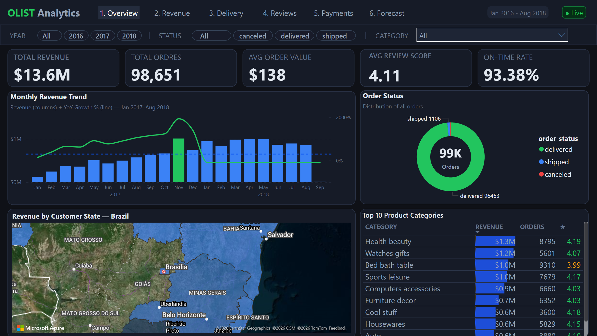
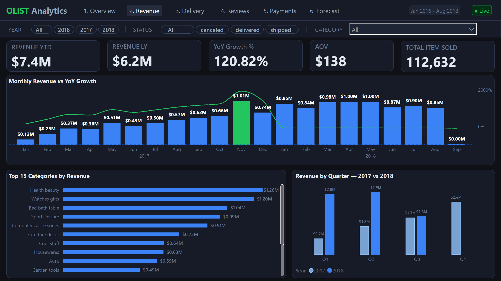
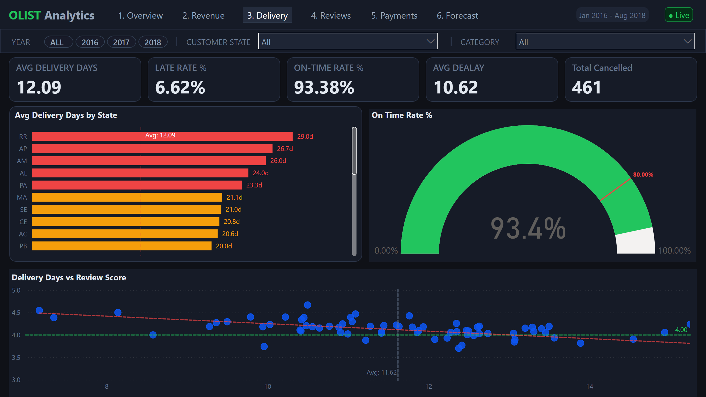
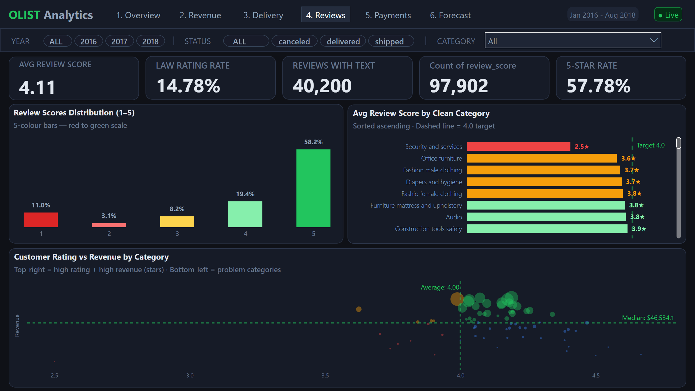
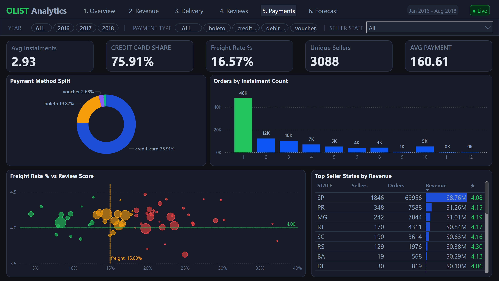
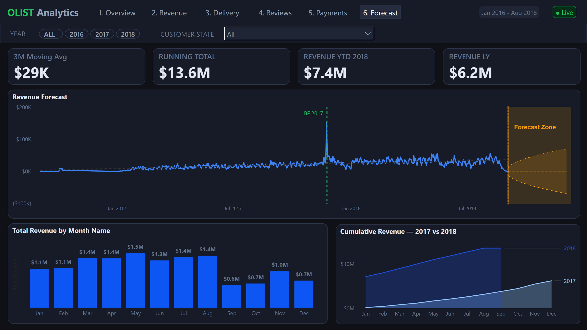

# Olist Brazilian E-Commerce Analytics Dashboard

> End-to-end data analytics project on **100,000 real orders** from Brazil's largest e-commerce marketplace (2016–2018).

**Tools:** Python · MS SQL Server · Power BI · DAX  
**Dataset:** [Brazilian E-Commerce Public Dataset by Olist — Kaggle](https://www.kaggle.com/datasets/olistbr/brazilian-ecommerce)  
**Live Dashboard:** [View on Power BI Service →](https://app.powerbi.com/view?r=eyJrIjoiZjk3OTFlZjEtYjZiMy00ZjdjLTljNDItMGY1OTliMGIzOTY0IiwidCI6IjU0OTJmYzlhLWQ0MTctNGRlMi05NDU0LTY3ZjM4YmZhMWYzNCJ9)

---



---

## Key Findings

| # | Finding | Data Point |
|---|---------|-----------|
| 1 | **Black Friday 2017** was Olist's single highest revenue day | R$178,450 in one day (24 Nov 2017) |
| 2 | **Credit cards** dominate payment — Brazil's instalment culture is visible | 73% of all orders paid by credit card |
| 3 | **São Paulo** sellers generate the most revenue of any state | SP accounts for 40%+ of total revenue |
| 4 | **Health & Beauty** and **Watches & Gifts** are the top two revenue categories | Combined ~20% of total revenue |
| 5 | **Late delivery correlates with poor reviews** | Late orders avg 0.8 points lower review score |
| 6 | **Revenue grew 21% from 2017 to 2018** | R$7.1M → R$8.6M year-over-year |
| 7 | **62% of customers never write a review** — only click a star rating | 58,431 of 99,000 orders have no review text |

---

## Dashboard Pages

| Page | Title | Key Visuals |
|------|-------|-------------|
| 1 | Executive Overview | KPI cards, Revenue trend, Status donut, Brazil map |
| 2 | Revenue & Sales | Dual-axis YoY chart, Top 15 categories, Quarterly compare |
| 3 | Delivery & Operations | State delivery bar, Gauge, Delivery vs Rating scatter |
| 4 | Reviews & Satisfaction | Score distribution, Category ratings, Rating vs Revenue scatter |
| 5 | Payments & Sellers | Payment donut, Instalment bar, Seller state table |
| 6 | Trend & Forecast | 3-month ETS forecast, Waterfall, Cumulative growth |

---

## Project Structure

```
olist-ecommerce-dashboard/
│
├── data/
│   ├── raw/                        ← 9 original CSV files from Kaggle (not uploaded)
│   └── clean/
│       ├── olist_master.csv        ← Merged master table (~97,000 rows, 40 columns)
│       ├── dim_customers.csv       ← Customer dimension
│       ├── dim_sellers.csv         ← Seller dimension
│       └── dim_products.csv        ← Product dimension (with English categories)
│
├── python/
│   └── clean_olist.py              ← Full cleaning & merging script
│
├── sql/
│   └── eda_queries.sql             ← 12 EDA queries with window functions
│
├── powerbi/
│   └── olist_dashboard.pbix        ← Power BI file (6 pages, 28 DAX measures)
│
├── docs/
│   ├── kpi_definitions.md          ← KPI definition document (BA layer)
│   └── executive_summary.md        ← One-page business summary
│
├── screenshots/
│   ├── dashboard_overview.png
│   ├── page1_overview.png
│   ├── page2_revenue.png
│   ├── page3_delivery.png
│   ├── page4_reviews.png
│   ├── page5_payments.png
│   └── page6_forecast.png
│
└── README.md
```

---

## Tools & Workflow

```
Raw CSVs (9 files)
    │
    ▼
Python / Pandas          ← Merge 9 tables, clean dates, add derived columns
    │
    ▼
MS SQL Server            ← 12 EDA queries (window functions, YoY with LAG)
    │
    ▼
Power BI Desktop         ← Star schema, DateTable, 28 DAX measures, 6-page dashboard
    │
    ▼
Power BI Service         ← Published & shared
```

---

## Python — Data Cleaning & Merging

**Script:** `python/clean_olist.py`

**What it does:**
- Loads all 9 raw CSV files
- Parses 5 date columns to `datetime64`
- Aggregates order items → one row per order (revenue, freight, item count)
- Aggregates payments → payment type, total, instalment count per order
- Deduplicates reviews (keeps highest score per order)
- Translates Portuguese product categories to English
- Merges all tables into a single `olist_master.csv`
- Adds 12 derived columns: `delivery_days`, `delay_days`, `is_late`, `year`, `quarter`, `weekday`, `is_delivered`, `has_review`, `low_rating` and more

**Libraries:** `pandas`, `numpy`

**Output:** `data/clean/olist_master.csv` — ~97,000 rows × 40 columns

---

## SQL — Exploratory Data Analysis

**Script:** `sql/eda_queries.sql`

| Query | Technique | Business Question |
|-------|-----------|-------------------|
| Monthly revenue trend | `GROUP BY`, `ORDER BY` | Which months drive revenue? |
| YoY growth | `LAG()` window function | How fast is Olist growing? |
| Top 10 categories | `TOP N`, `ORDER BY` | What sells the most? |
| Delivery performance | `CASE WHEN`, `AVG()` | How reliable is shipping? |
| Payment type split | `OVER()` window, `%` | How do customers pay? |
| Review distribution | `GROUP BY`, `%` | How satisfied are customers? |
| Top seller states | `GROUP BY`, `SUM()` | Which states generate revenue? |
| Customer state map | `GROUP BY`, `COUNT()` | Where are the buyers? |
| Freight vs price | `DIVIDE()`, `AVG()` | Which categories have high shipping? |
| Cancellation rate | `CASE WHEN`, `%` | Which categories get cancelled most? |
| Instalment analysis | `CASE WHEN` banding | Single vs multi-payment preference |
| Low rating drivers | `AVG()`, `ASC sort` | What gets the worst reviews? |

---

## Power BI — Data Model

**File:** `powerbi/olist_dashboard.pbix`

### Star Schema

```
                    ┌─────────────┐
                    │  DateTable  │
                    │  (DAX-built)│
                    └──────┬──────┘
                           │
         ┌─────────────────┼─────────────────┐
         │                 │                 │
  ┌──────┴──────┐  ┌───────┴───────┐  ┌─────┴──────┐
  │dim_customers│  │ olist_master  │  │dim_sellers │
  │             │  │  (FACT TABLE) │  │            │
  └─────────────┘  └───────┬───────┘  └────────────┘
                           │
                    ┌──────┴──────┐
                    │dim_products │
                    │             │
                    └─────────────┘
```

**Relationships:** All Many-to-One, single cross-filter direction  
**DateTable:** Created in DAX, marked as Date Table for time intelligence  
**_Measures table:** All 28 DAX measures stored in a dedicated table

### DAX Measures (28 total)

**Revenue & Orders**
- `Total Revenue`, `Total Freight`, `Total Order Value`, `Total Orders`, `AOV`, `Total Items Sold`

**Time Intelligence**
- `Revenue MTD`, `Revenue QTD`, `Revenue YTD`, `Revenue LY`, `YoY Growth %`, `Running Total`, `3M Moving Avg`

**Delivery & Operations**
- `Avg Delivery Days`, `Late Orders`, `Late Rate %`, `On Time Rate %`, `Avg Delay Days`

**Customer & Reviews**
- `Unique Customers`, `Unique Sellers`, `Avg Review Score`, `Low Rating Rate %`, `Reviews with Text`

**Payment & Freight**
- `Avg Instalments`, `Freight Rate %`, `Credit Card Orders`, `CC Share %`, `5-Star Rate %`

---

## How to Run

### 1. Download Dataset
```
kaggle datasets download -d olistbr/brazilian-ecommerce
```
Or download manually from: https://www.kaggle.com/datasets/olistbr/brazilian-ecommerce  
Extract all 9 CSV files into `data/raw/`

### 2. Python Cleaning
```bash
pip install pandas numpy
python python/clean_olist.py
```
Output: `data/clean/olist_master.csv` (~97,000 rows)

### 3. SQL EDA
```
1. Open SQL Server Management Studio (SSMS)
2. Create database: OlistDashboard
3. Import Flat File: data/clean/olist_master.csv
4. Open and run: sql/eda_queries.sql
```

### 4. Power BI Dashboard
```
1. Open Power BI Desktop
2. Get Data → Text/CSV → select data/clean/olist_master.csv
3. All relationships, measures and formatting are pre-built
4. Refresh data source if prompted
```

---

## Dashboard Screenshots

| Page | Preview |
|------|---------|
| Overview |  |
| Revenue |  |
| Delivery |  |
| Reviews |  |
| Payments |  |
| Forecast |  |

---

## Skills Demonstrated

`Python` · `Pandas` · `Data Cleaning` · `Data Merging` · `MS SQL Server` · `Window Functions` · `YoY Analysis` · `Power BI` · `DAX` · `Time Intelligence` · `Star Schema` · `Data Modelling` · `Dashboard Design` · `Forecasting` · `KPI Definition` · `Storytelling with Data` · `E-Commerce Analytics` · `GitHub`

---

## Dataset

| File | Description | Rows |
|------|-------------|------|
| olist_orders_dataset.csv | Core order data | 99,441 |
| olist_order_items_dataset.csv | Line items: price, freight | 112,650 |
| olist_order_payments_dataset.csv | Payment method, instalments | 103,886 |
| olist_order_reviews_dataset.csv | Review score + text | 99,224 |
| olist_customers_dataset.csv | Customer city, state | 99,441 |
| olist_sellers_dataset.csv | Seller city, state | 3,095 |
| olist_products_dataset.csv | Category, dimensions | 32,951 |
| olist_geolocation_dataset.csv | Zip → lat/lng | 1,000,163 |
| product_category_name_translation.csv | Portuguese → English | 71 |

**Source:** [Olist on Kaggle](https://www.kaggle.com/datasets/olistbr/brazilian-ecommerce)  
**Period:** January 2016 – August 2018  
**Country:** Brazil  
**Real commercial data** — anonymised by Olist

---

## Author

**Ravi**  
[LinkedIn](https://www.linkedin.com/in/ravi-parmar-25836636) · [GitHub](https://github.com/RaviData007)	

---

*Real commercial data provided by Olist. Used for portfolio and educational purposes.*
